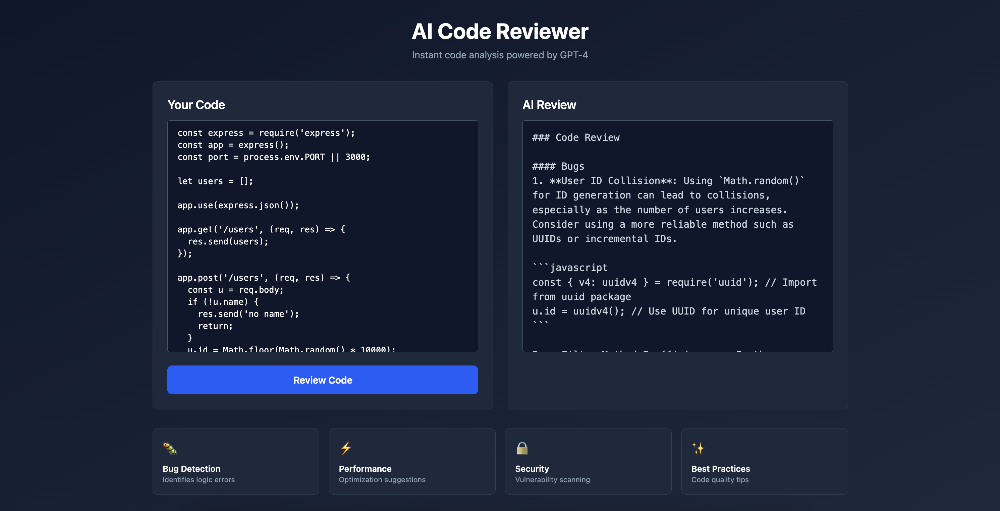

# AI Code Reviewer

> Instant code analysis powered by GPT-4 - get professional feedback on your code in seconds.

🌐 **Live Demo:** [https://ai-code-reviewer-pro.vercel.app](https://ai-code-reviewer-pro.vercel.app)



## 📋 Table of Contents

- [Overview](#overview)
- [Features](#features)
- [Quick Start](#quick-start)
- [Getting Your OpenAI API Key](#getting-your-openai-api-key)
- [Local Development](#local-development)
- [Deployment](#deployment)
- [Security](#security)
- [Example](#example)
- [Tech Stack](#tech-stack)
- [Troubleshooting](#troubleshooting)

## Overview

AI Code Reviewer is a web application that provides instant, AI-powered code analysis. Simply paste your code and get professional feedback on bugs, performance, security, and best practices.

**🔗 Try it now:** [https://ai-code-reviewer-pro.vercel.app](https://ai-code-reviewer-pro.vercel.app)

### The Problem

- Manual code reviews take time
- Junior developers need instant feedback  
- Senior developers need quick sanity checks
- Learning proper patterns is hard without guidance

### The Solution

AI-powered code analysis that reviews your code instantly, identifying:
- 🐛 **Bugs** - Logic errors and potential issues
- ⚡ **Performance** - Optimization opportunities
- 🔒 **Security** - Vulnerability scanning
- ✨ **Best Practices** - Code quality improvements

## Features

- ⚡ **Instant Analysis** - Get feedback in 5-10 seconds
- 🎯 **Specific Suggestions** - Actionable improvements, not generic advice
- 🌐 **Multi-Language** - Supports JavaScript, Python, TypeScript, and more
- 🚀 **No Signup Required** - Paste code and go
- 🔐 **Secure** - API key protected server-side with rate limiting
- 🤖 **Bot Protection** - Automatic detection and prevention of abuse

## Quick Start

### Prerequisites

- Node.js 18+ installed ([Download](https://nodejs.org/))
- OpenAI API key ([Get one here](https://platform.openai.com/api-keys))
- npm or yarn package manager

### Installation

1. **Clone the repository:**
   ```bash
   git clone https://github.com/fastians/ai-code-reviewer.git
   cd ai-code-reviewer
   ```

2. **Install dependencies:**
   ```bash
   npm install
   ```

3. **Set up environment variables:**
   ```bash
   # Create .env file
   echo "OPENAI_API_KEY=your_openai_api_key_here" > .env
   ```
   
   > ⚠️ **Important:** Never commit `.env` to git! It's already in `.gitignore`.

4. **Start the development server:**
   ```bash
   npm run dev
   ```

5. **Open your browser:**
   Navigate to `http://localhost:5173`

That's it! You're ready to review code. 🎉

## Getting Your OpenAI API Key

1. **Sign up/Login** to [OpenAI Platform](https://platform.openai.com/)
2. **Navigate** to [API Keys](https://platform.openai.com/api-keys)
3. **Create** a new secret key
4. **Copy** the key (you won't see it again!)
5. **Add** it to your `.env` file for local development, or Vercel environment variables for production

> 💡 **Tip:** Start with a small amount of credits to test. OpenAI charges per API call.

## Local Development

### Running the App

The app runs in two parts:

1. **Frontend** (Vite) - `http://localhost:5173`
2. **API Server** (Express) - `http://localhost:3001`

Both start automatically with:
```bash
npm run dev
```

### Available Scripts

| Command | Description |
|---------|-------------|
| `npm run dev` | Start both frontend and API server (recommended) |
| `npm run dev:client` | Start only frontend (Vite) |
| `npm run dev:server` | Start only API server (Express) |
| `npm run build` | Build for production |
| `npm run preview` | Preview production build |
| `npm run lint` | Run ESLint |

### Project Structure

```
ai-code-reviewer/
├── api/
│   ├── shared.js         # Shared logic (rate limiting, bot detection, OpenAI calls)
│   └── review.ts         # Serverless function (Vercel) - uses shared.js
├── src/
│   ├── App.tsx           # Main React component
│   └── main.tsx          # Entry point
├── public/               # Static assets
├── server.js             # Local Express server (dev only) - uses api/shared.js
├── vercel.json          # Vercel configuration
└── package.json         # Dependencies
```

> 💡 **Note:** The code logic is shared between `api/review.ts` (production) and `server.js` (local dev) via `api/shared.js`. This ensures consistent behavior and eliminates code duplication.

## Deployment

### ✅ Works on Vercel - No Next.js Required!

Your Vite + React setup works perfectly on Vercel. The `api/review.ts` file automatically becomes a serverless function.

### Option 1: Deploy via GitHub (Recommended)

1. **Push your code to GitHub:**
   ```bash
   git add .
   git commit -m "Ready for deployment"
   git push origin main
   ```

2. **Connect to Vercel:**
   - Go to [vercel.com](https://vercel.com) and sign in
   - Click **"Add New Project"**
   - Import your GitHub repository
   - Vercel will auto-detect Vite

3. **Set Environment Variable:**
   - Go to **Project Settings** → **Environment Variables**
   - Add `OPENAI_API_KEY` with your OpenAI API key
   - Select all environments (Production, Preview, Development)
   - Click **Save**

4. **Deploy:**
   - Click **"Deploy"**
   - Wait for build to complete (~2-3 minutes)
   - Your app is live! 🚀
   - **Production URL:** [https://ai-code-reviewer-pro.vercel.app](https://ai-code-reviewer-pro.vercel.app)

### Option 2: Deploy via CLI

1. **Install Vercel CLI:**
   ```bash
   npm install -g vercel
   ```

2. **Login:**
   ```bash
   vercel login
   ```

3. **Deploy:**
   ```bash
   vercel
   ```

4. **Set Environment Variable:**
   ```bash
   vercel env add OPENAI_API_KEY
   ```
   Enter your key when prompted, select all environments.

5. **Deploy to Production:**
   ```bash
   vercel --prod
   ```

> 📖 **Need more details?** See [DEPLOYMENT.md](./DEPLOYMENT.md) for comprehensive deployment guide.

## Security

### Built-in Protection

✅ **API Key Protection** - Stored server-side only, never exposed to frontend  
✅ **Rate Limiting** - Prevents abuse and excessive API usage  
✅ **Bot Detection** - Automatic detection with stricter limits  
✅ **Input Validation** - Maximum 10,000 characters per request  
✅ **Error Handling** - Secure error messages without exposing sensitive data  

### Rate Limits

| User Type | Limit | Reset Time |
|-----------|-------|------------|
| Normal Users | 5 requests/24h | 24 hours |
| Detected Bots | 2 requests/24h | 24 hours |
| Code Length | 10,000 characters | Per request |

### Bot Protection

The system automatically detects bots based on:
- User agent patterns (`curl`, `wget`, `python`, `selenium`, etc.)
- Missing browser headers (`Accept`, `Accept-Language`)
- Suspicious request patterns

Detected bots receive stricter rate limits (2 requests per 24 hours vs 5 for normal users).

> 🔒 **Security Details:** See [SECURITY.md](./SECURITY.md) for comprehensive security documentation.

## Example

### Sample Code Input

```javascript
const express = require("express");
const app = express();
const port = process.env.PORT || 3000;

let users = [];

app.use(express.json());

app.get("/users", (req, res) => {
  res.send(users);
});

app.post("/users", (req, res) => {
  const u = req.body;
  if (!u.name) {
    res.send("no name");
    return;
  }
  u.id = Math.floor(Math.random() * 10000);
  users.push(u);
  res.send(u);
});

app.get("/user/:id", (req, res) => {
  const id = req.params.id;
  const found = users.filter((u) => u.id == id)[0];
  if (!found) {
    res.send("not found");
  } else {
    res.send(found);
  }
});

app.listen(port, () => {
  console.log("server started on port " + port);
});
```

### Sample AI Review Output

#### 🐛 Bugs

1. **User ID Collision**: Using `Math.random()` for ID generation can lead to collisions. Consider using UUIDs or incremental IDs.

```javascript
const { v4: uuidv4 } = require('uuid');
u.id = uuidv4();
```

2. **Filter Method Inefficiency**: Using `filter` followed by accessing the first element is inefficient. Use `find()` instead.

```javascript
const found = users.find(u => u.id == id);
```

#### ⚡ Performance

- **Array Storage**: Consider using a database for scalable storage
- **JSON Response**: Use `res.json()` instead of `res.send()`

#### 🔒 Security

- **Input Validation**: Validate user input using libraries like `express-validator`
- **HTTP Status Codes**: Return appropriate status codes (400, 404, etc.)

#### ✨ Best Practices

- **Error Handling**: Create middleware for consistent error handling
- **Modularization**: Break out route handlers into separate modules
- **Documentation**: Add JSDoc comments for better code documentation

## Tech Stack

| Category | Technology |
|----------|-----------|
| **Frontend** | React 19, TypeScript, Tailwind CSS |
| **Build Tool** | Vite |
| **Backend** | Vercel Serverless Functions |
| **AI** | OpenAI GPT-4o-mini |
| **Deployment** | Vercel |
| **Icons** | Lucide React |

## Troubleshooting

### ❓ API Not Working Locally?

**Problem:** Getting errors when trying to review code locally.

**Solutions:**
- ✅ Make sure both servers are running (`npm run dev`)
- ✅ Check that `OPENAI_API_KEY` is set in `.env`
- ✅ Verify the API server is running on port 3001
- ✅ Check browser console for errors

### ❓ Rate Limit Exceeded?

**Problem:** Getting "Rate limit exceeded" error.

**Solutions:**
- ✅ Wait 24 hours for the limit to reset
- ✅ Each IP address has its own limit
- ✅ Bots get stricter limits automatically
- ✅ Check if you're making too many requests

### ❓ Build Fails on Vercel?

**Problem:** Deployment fails with build errors.

**Solutions:**
- ✅ Check build logs in Vercel dashboard
- ✅ Ensure all dependencies are in `package.json`
- ✅ Verify TypeScript compiles without errors
- ✅ Check that `OPENAI_API_KEY` is set in environment variables

### ❓ Environment Variable Not Working?

**Problem:** API key not found error.

**Solutions:**
- ✅ Verify `OPENAI_API_KEY` is set in Vercel environment variables
- ✅ Make sure you selected all environments (Production, Preview, Development)
- ✅ Redeploy after adding environment variables
- ✅ Check variable name spelling (case-sensitive)

### ❓ Still Having Issues?

- 📖 Check [SECURITY.md](./SECURITY.md) for security details
- 📖 Check [DEPLOYMENT.md](./DEPLOYMENT.md) for deployment help
- 🐛 Open an issue on GitHub

## Contributing

Contributions are welcome! Please feel free to submit a Pull Request.

## License

This project is open source and available under the [MIT License](LICENSE).

## Acknowledgments

- Built with [React](https://react.dev/)
- Powered by [OpenAI](https://openai.com/)
- Deployed on [Vercel](https://vercel.com/)
- Icons by [Lucide](https://lucide.dev/)

---

**Made with ❤️ for developers who want instant code feedback**
